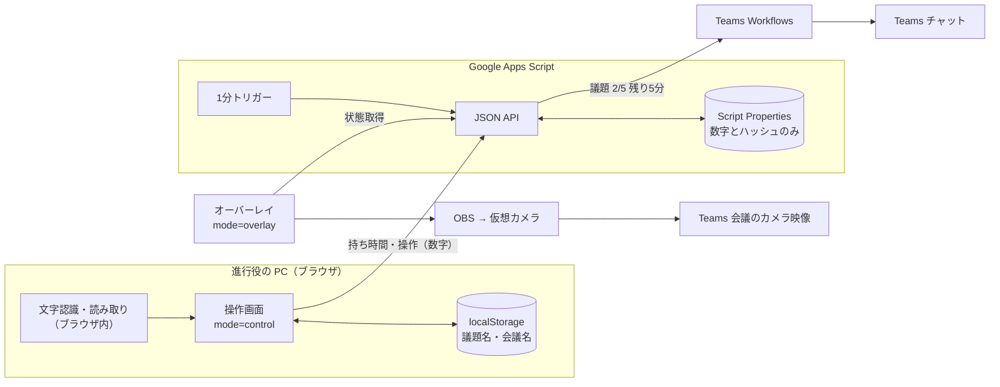

# Teams 会議タイマー（teams-meeting-timer）

Microsoft Teams の社内会議で、発表者の残り時間を「Teams チャット通知」と「カメラ映像への重畳表示」で見える化するタイマーです。

## 0. 情報の扱い（社外に文字情報を出さない設計）

会社のセキュリティ方針に合わせ、**議題名・発表者名・会議名・画像・資料を社外に送信しない**作りにしています。

| データ | 置き場所 | 社外（Google）に送るか |
|---|---|---|
| 貼り付けた画像 | ブラウザのメモリのみ。読み取り後・画面を閉じたときに消去 | 送らない |
| 貼り付けた文章 | ブラウザのメモリのみ。アジェンダ適用時に消去 | 送らない |
| 議題名・発表者名・会議名 | この PC のブラウザ（localStorage）のみ。「議題名を消去」で削除可 | 送らない |
| ルーム名・合言葉 | この PC のブラウザ（合言葉はハッシュのみ保存） | ハッシュ値だけ送る（元の文字は届かない） |
| 進行役の会員情報（メールアドレス・ニックネーム・パスワード） | GAS の会員スプレッドシート（パスワードはハッシュのみ） | **送る**（会員認証のため。会社の方針で許可済み） |
| 持ち時間（分）、議題番号、残り時間、終了予定時刻 | GAS（Google） | **送る（数字のみ）** |
| Teams 通知カード | Teams チャット（社内） | GAS から送信。中身は「議題 2 / 5　残り5分」のような数字のみ |

- 画像の文字認識とアジェンダの読み取りは、すべてブラウザの中で行います。初回だけ文字認識プログラム（Tesseract.js）をダウンロードしますが、画像は送信しません。
- GAS は、万一文字が送られてきても保存前に数字以外を捨てます（`sanitizeState_`）。ログにも受信内容は書きません。
- 共有 URL のルーム ID と閲覧キーは `#` の後ろに置いています。`#` 以降はブラウザからどのサーバーにも送られません。
- AI（Gemini）と Google ドライブ連携は、方針に合わせて廃止しました。
- 会員登録・ログインは進行役だけが使います。発表者・参加者・OBS はログイン不要です。

---

## 1. 方式の比較と選定

| 観点 | A. Teams チャット通知 | B. カメラ映像に重ねる（OBS） | C. 閲覧画面を画面共有 |
|---|---|---|---|
| 端末への導入 | 不要 | OBS のインストール（管理者権限） | 不要 |
| 参加者の見やすさ | △ チャットを開いていないと気づきにくい | ◎ 常に見える | ○ 大きく見える |
| 資料の画面共有と同時 | ○ | ◎ | × |
| 記録 | ◎ チャットに残る | × | × |
| 向いている用途 | 全会議の標準 | 発表会・時間厳守の会議 | 休憩・質疑応答の表示 |

**おすすめ**：A を標準にし、時間を厳守したい会議だけ B を足します。B はタイムキーパーの PC 1 台に集約すると、管理者権限の申請が 1 回で済みます。

---

## 2. システム構成



- カウントダウンはブラウザ側で計算し、GAS には終了予定時刻だけを置きます。各画面はサーバー時刻との差を補正して描画するので、表示がそろいます。
- 通知はブラウザ（しきい値の通過を検知）と 1 分トリガーの二重化です。発火済みかどうかはロック内で判定するため、通知は 1 回だけです。
- 通信が切れても表示は止まりません。

---

## 3. ファイル構成

```
teams-meeting-timer/
├─ config.js        接続先（GAS の URL）と文字認識プログラムの読み込み先
├─ index.html       タイマー画面（操作・閲覧・オーバーレイの 3 モード共通）
├─ style.css
├─ app.js           画面の処理、アジェンダの読み取り（ブラウザ内）
├─ auth.js          進行役の会員認証（ログイン・登録・再発行・パスワード解析）
├─ gas/
│  ├─ Code.gs        バックエンド（タイマー・通知・会員認証。この 1 ファイルだけ）
│  └─ appsscript.json
└─ README.md
```

---

## 4. セットアップ

### 4-1. GAS

1. `gas/Code.gs` と `gas/appsscript.json` を GAS プロジェクトに貼り付けます（clasp なら `clasp push`）。
2. スクリプト プロパティに `TEAMS_WEBHOOK_URL` を登録します（5 章）。
3. エディタで `setup()` を実行し、権限を承認します（スプレッドシートとメール送信の権限が求められます）。会員スプレッドシートと `PEPPER` がこのとき作られます。ログに出る `MASTER_TOKEN` は非常用として管理者が保管します。
4. デプロイ → ウェブアプリ（次のユーザーとして実行：自分／アクセスできるユーザー：全員）。既存のデプロイは「新バージョン」で更新します。

| スクリプト プロパティ | 内容 |
|---|---|
| `TEAMS_WEBHOOK_URL` | Teams Workflows の Webhook URL |
| `TEAMS_WEBHOOK_URL__<ルーム ID>` | 任意。ルームごとに投稿先を変える場合。ルーム ID は共有ダイアログに表示 |
| `MASTER_TOKEN` | `setup()` で自動生成。合言葉を忘れたとき、これを合言葉として入室すると変更できる |
| `MEMBERS_SHEET_ID` / `PEPPER` | `setup()` で自動作成。会員シートとパスワードハッシュ用の秘密値（PEPPER を変えると全員ログイン不可） |
| `ALLOWED_EMAIL_DOMAINS` | 推奨。登録できるメールのドメイン（例 `azbil.com`） |
| `APP_URL` | 任意。仮パスワードのメールに載せる画面の URL |
| `room:<ID>` / `auth:<ID>` | 自動。ルームの状態（数字）と合言葉のハッシュ |

### 4-2. 旧バージョンからの移行（必ず実施）

旧バージョンでは議題名を Google 側に保存していました。次の手順で削除してください。会員情報（会員スプレッドシート）は残ります。

1. GAS エディタで `purgeLegacyData()` を実行します。旧形式のルーム（議題名を含む）と、Gemini・ドライブ連携の設定値を削除します。
2. Google AI Studio で、使っていた Gemini API キーを削除（無効化）します。

### 4-3. タイマー画面の公開

`config.js` の `apiUrl` に GAS の URL を書き、`index.html`・`style.css`・`app.js`・`config.js` を GitHub Pages などに置きます。社内サーバーに置いても動きます。

社内ネットワークで jsDelivr（CDN）が使えない場合は、Tesseract.js のファイルを社内サーバーに置き、`config.js` の `tesseractUrl` を書き換えてください。文字認識が使えなくても、文章の貼り付けと手入力は使えます。

---

## 4-4. 会員認証（進行役）

| 機能 | 内容 |
|---|---|
| 新規登録 | ニックネームとメールアドレス → 仮パスワード（10文字、24時間有効）をメールで送信 |
| 初回ログイン | 仮パスワードでログインするとパスワード変更画面が開き、変更するまで操作できない |
| パスワード解析 | 入力中に強さ（弱い／普通／強い／とても強い）と条件を表示。必須条件を満たし確認欄と一致するまで変更できない |
| パスワードを忘れた | 仮パスワードを再発行してメール送信。元のパスワードも使えるまま。同じメールへは5分に1回まで |
| 表示・非表示 | すべてのパスワード欄に「表示／隠す」ボタン |
| ロック | ログインに5回失敗すると15分ロック |
| ルームとの関係 | ルームの作成・操作には「ログイン」と「合言葉」の両方が必要。削除は作成者のみ |

管理用の関数：`setMemberStatus()`（利用停止／再開）、`showMembersSheetUrl()`（会員シートの URL 表示）。

---

## 5. Teams チャット通知の設定

1. Teams で通知を出したい会議チャット（またはチャネル）の「…」→「ワークフロー」。
2. 「Webhook 要求を受信したらチャットに投稿する」（チャネルなら「…チャネルに投稿する」）を選びます。
3. 名前を付けて「次へ」→ 投稿先を確認して「ワークフローを追加」。
4. 表示された URL を GAS の `TEAMS_WEBHOOK_URL` に登録します。
5. タイマー画面の「テスト通知を送る」で確認します。

- 繰り返し会議は同じチャットが使われるので、設定は 1 回で済みます。単発会議が多い場合はチャネルに送る設定が便利です。
- URL を知っていれば誰でも投稿できるので、パスワードと同様に扱ってください。
- 通知カードの内容：「⏳ 残り 5分」「議題 2 / 5」「持ち時間」「終了予定」「次の議題：3 番目（10分）」。議題名は入りません。

---

## 6. OBS／仮想カメラの設定

1. 操作画面の「オーバーレイ・共有URL」で背景・位置・大きさを選び、オーバーレイ URL をコピーします。
2. OBS：設定 → 映像を 1280×720（30fps）。ソース「映像キャプチャデバイス」でカメラを追加。
3. ソース「ブラウザ」を追加し、URL にオーバーレイ URL、幅・高さを映像と同じにします。「表示されていないときにソースをシャットダウン」はオフ。
4. 「仮想カメラ開始」→ Teams の 設定 → デバイス → カメラで「OBS Virtual Camera」を選択。
5. Teams の背景効果（ぼかし）はオフにします（タイマーまでぼけるため）。

グリーンバックで合成する場合は、URL の背景を「グリーンバック」にし、OBS のフィルタ「クロマキー」で抜きます。

オーバーレイには議題名を出さず「議題 2 / 5」と表示します（議題名は進行役の PC にしかないため）。

---

## 7. 運用マニュアル

### 会議の前

1. 操作画面でログインし（初回は新規登録）、「ルームと合言葉」でルーム名と合言葉を入れます。初めてのルーム名なら、確認入力のあと作成されます。
2. 「アジェンダを取り込む」で次のどれかを使います。
   - **画像から読み取る**：アジェンダのスクリーンショットを Ctrl+V（操作画面のどこで貼り付けても可）。「読み取る」を押すと、ブラウザ内で文字認識します。
   - **文章から読み取る**：招集メールのアジェンダ部分を貼り付けて「読み取る」。
   - **手で入力**：表に直接入力。
3. 黄色の枠（持ち時間を読み取れなかった行）を中心に確認・修正し、「このアジェンダで始める」。
4. 「テスト通知を送る」で Teams を確認します。

**読み取れる書き方**：`10:00-10:15`、`10時〜10時15分`、`15分`、`15min`、`1時間`、開始時刻だけの並び（次の行との差を計算）、`（佐藤）`、`担当：佐藤`、`発表：佐藤`。番号や「・」付きで時間のない行は 5 分（要確認）として入ります。

### 会議中

- 「開始」（Space）、「次の議題」（→）、時間調整（+ / −）。
- アジェンダにない時間は「アジェンダ外で ○ 分」。

### 会議の後

- 共用 PC の場合は「ルームと合言葉」→「議題名を消去」で、この PC に残った議題名を消します。
- Teams チャットに残った通知で、どの議題（番号）が何分超過したかを振り返れます。

### URL パラメータ

| 場所 | パラメータ | 説明 |
|---|---|---|
| `?` の後 | `mode` | `control` / `view` / `overlay` |
| `?` の後 | `bg` `pos` `size` `bar` `hideIdle` | オーバーレイの見た目 |
| `#` の後 | `r` | ルーム ID（ルーム名のハッシュ） |
| `#` の後 | `k` | 閲覧キー |

---

## 8. トラブルシューティング

| 症状 | 対処 |
|---|---|
| 「合言葉（または閲覧キー）が違います」 | 合言葉が変更されていないか確認。オーバーレイなら閲覧キーが作り直されていないか確認し、URL を貼り直す |
| 「このルームはまだありません」 | ルーム名の綴り（大文字・小文字も区別）を確認 |
| 「10 分間入れません」 | 合言葉を 10 回間違えたため。10 分待つ |
| 合言葉を忘れた | 管理者が `MASTER_TOKEN` を合言葉として入室し、「合言葉を変える」で再設定 |
| 文字認識プログラムを読み込めない | 社内ネットワークが CDN を遮断している可能性。`tesseractUrl` を社内に置いたファイルに変更するか、文章の貼り付けを使う |
| 画像の読み取り精度が低い | 文字が大きく写るように切り取って貼る。読み取った文字は「文章から読み取る」に入るので、直してから読み取り直す |
| 別の PC で議題名が出ない | 仕様です（議題名はその PC にだけ保存）。その PC でアジェンダを取り込み直すと表示されます |
| 通知が 1 分ほど遅れる | ブラウザを閉じていてトリガーだけで判定した場合の仕様。操作画面を開いておけば数秒で届く |
